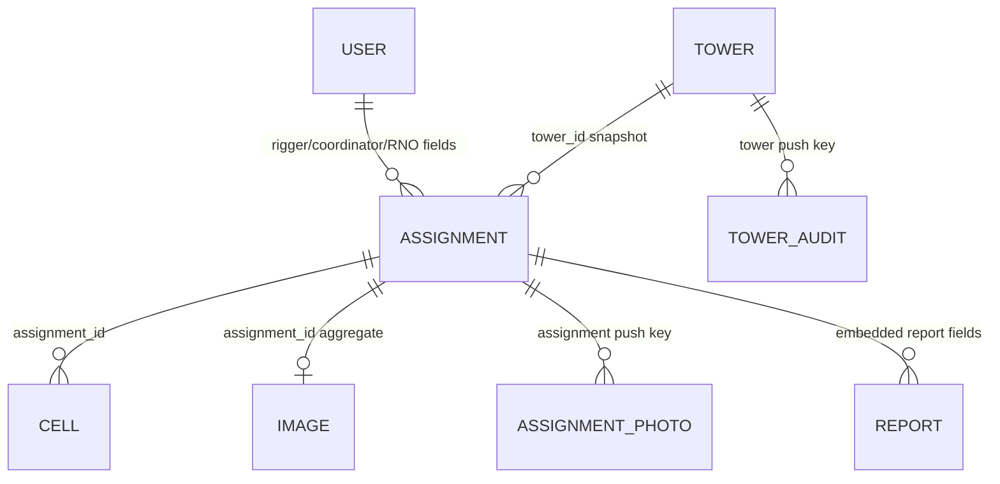

# Relationship graph

These are logical relationships only; RTDB enforces no foreign keys. Tower/Assignment/Cell relationships use business child fields, while audit/photo nesting uses Firebase push keys. Embedded image relationships are dynamic field-name and metadata based.
