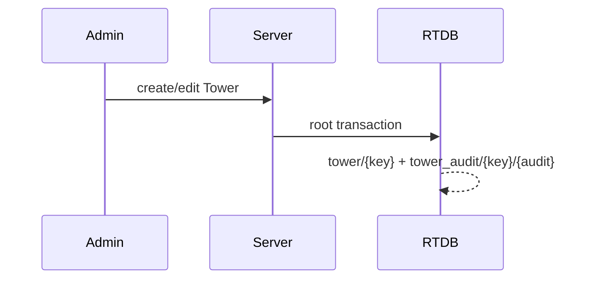
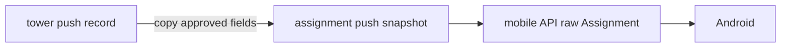
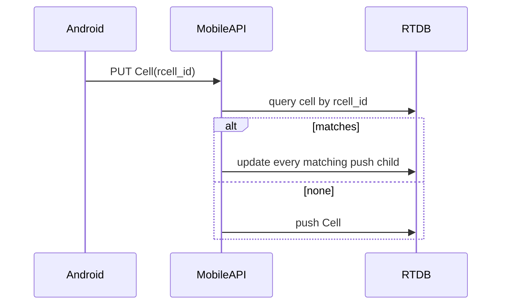
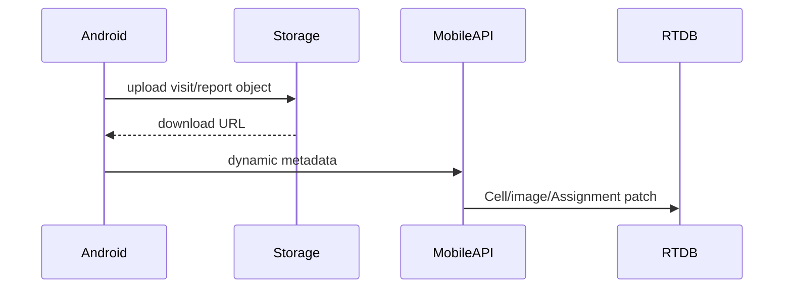
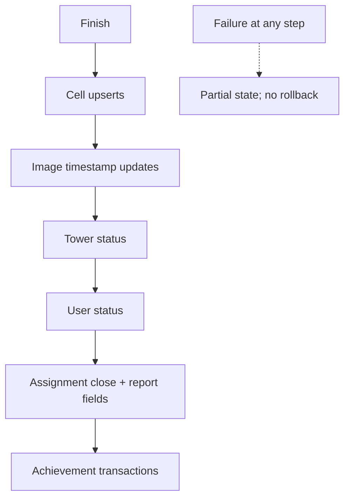
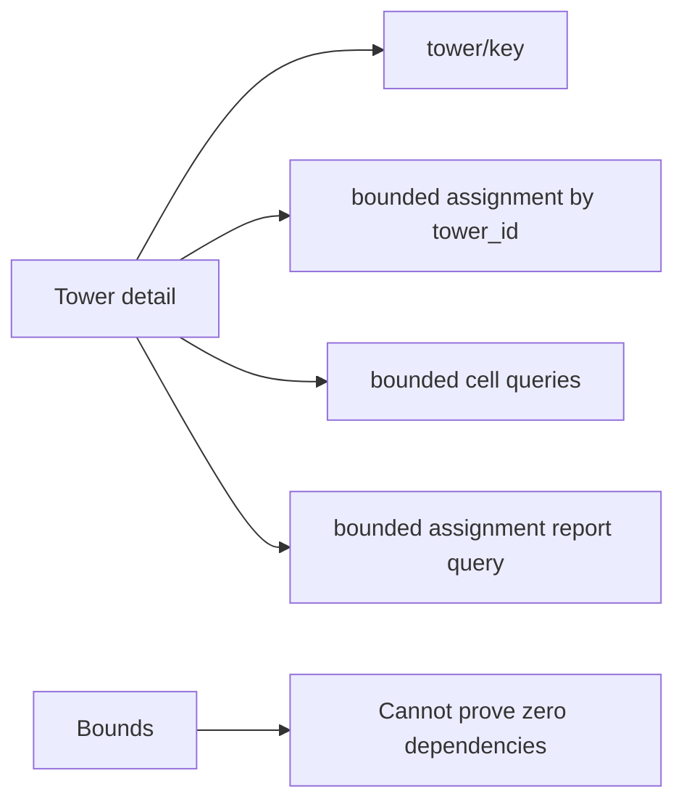
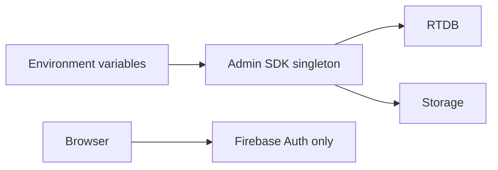

# Data-flow diagrams

```mermaid
sequenceDiagram
  Admin->>Server: create/edit Tower
  Server->>RTDB: root transaction
  RTDB-->>RTDB: tower/{key} + tower_audit/{key}/{audit}
```

```mermaid
flowchart LR
  T[tower push record] -->|copy approved fields| A[assignment push snapshot]
  A --> M[mobile API raw Assignment]
  M --> Android
```

```mermaid
sequenceDiagram
  Android->>MobileAPI: PUT Cell(rcell_id)
  MobileAPI->>RTDB: query cell by rcell_id
  alt matches
    MobileAPI->>RTDB: update every matching push child
  else none
    MobileAPI->>RTDB: push Cell
  end
```

```mermaid
sequenceDiagram
  Android->>Storage: upload visit/report object
  Storage-->>Android: download URL
  Android->>MobileAPI: dynamic metadata
  MobileAPI->>RTDB: Cell/image/Assignment patch
```

```mermaid
flowchart TD
  F[Finish] --> C[Cell upserts]
  C --> I[Image timestamp updates]
  I --> T[Tower status]
  T --> U[User status]
  U --> A[Assignment close + report fields]
  A --> H[Achievement transactions]
  X[Failure at any step] -.-> P[Partial state; no rollback]
```

```mermaid
flowchart LR
  Detail[Tower detail] --> Tower[tower/key]
  Detail --> Assign[bounded assignment by tower_id]
  Detail --> Cells[bounded cell queries]
  Detail --> Reports[bounded assignment report query]
  Bounds --> Unsafe[Cannot prove zero dependencies]
```

```mermaid
flowchart LR
  Env[Environment variables] --> Admin[Admin SDK singleton]
  Admin --> RTDB
  Admin --> Storage
  Browser --> Auth[Firebase Auth only]
```
